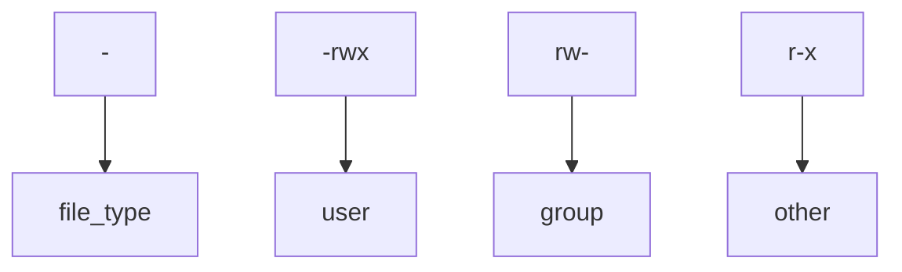

### Accessing machine using SSH
```zsh
ssh user_name@MACHINE_IP
```
- SSH allows us to remotely execute commands on another device remotely.
- Any data sent between the devices is encrypted when it is sent over a network such as the Internet
### Flags, switches and options

#### flags
- Flags are Boolean arguments that are set by the mere inclusion of the command-line argument, with no additional data needed or allowed for the argument.
- Example 
```zsh
ls -a
```
- -a is a flag to show hidden files
#### switches
- Switches are similar to flags but can take additional arguments. They are used to control specific features or behaviors.
- Example
```zsh
rm -r folder/
```
- -r switch is used to switch the command execution process to recursive. 
#### options
- Options provide additional information to a command. They can take values and modify the behavior of the command.
- Example 
```zsh
sudo -u username
```
- -u is an option to provide a username

### permission 101



> [!Note]
>   r - read
>w - write
>x - execute


### Common Directories

#### /etc
 location to store system files that are used by your operating system.
 #### /var
  stores data that is frequently accessed or written by services or applications running on the system.
  #### /root
  is actually the home for the "root" system user
  #### /tmp
  is volatile and is used to store data that is only needed to be accessed once or twice and it acts as RAM. By default any user can write to this folder.
  